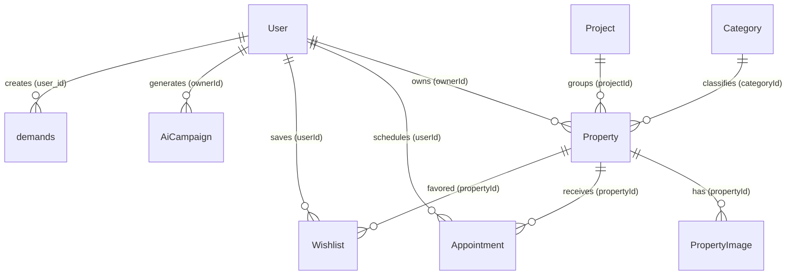

# BDS Rental - Hệ thống Tìm kiếm & Cho thuê Bất động sản

**BDS Rental** là nền tảng tìm kiếm, đăng tin và quản lý bất động sản (cho thuê & mua bán) toàn diện, di chuyển từ Laravel sang **Next.js 15 (App Router, TypeScript)**. Hướng tới trải nghiệm cao cấp với bản đồ tương tác, AI Chatbot tư vấn, bộ công cụ AI Marketing và tích hợp đồng bộ hai chiều với hệ thống NKS.

---

## 🚀 Tính năng nổi bật (Core Features)

### 1. Phân quyền Người dùng (4 Roles)
| Role | Quyền hạn chính |
|---|---|
| **tenant** | Xem tin, đặt lịch, lưu yêu thích, đăng ký làm chủ nhà |
| **owner** | Đăng tin, quản lý tin, duyệt lịch hẹn, AI Marketing |
| **agent** | Quyền giống owner, thuộc hệ thống môi giới |
| **admin** | Toàn quyền hệ thống, duyệt/xóa tin, quản lý user |

### 2. Bản đồ Tìm kiếm Tương tác (MapLibre GL JS)
- Bản đồ tràn viền hiển thị ghim giá BĐS theo tọa độ GPS thực tế
- Sidebar danh sách đồng bộ hai chiều với bản đồ (hover highlight)
- Nút Định vị GPS qua Geolocation API
- Bộ lọc capsule ngang: Loại giao dịch, Loại hình, Giá, Diện tích, Hướng nhà

### 3. AI Sales Chatbot (Gemini)
- Tư vấn BĐS thông minh, dẫn dắt thu thập 5 thông tin Lead
- Đồng bộ Lead tự động lên hệ thống CRM SCRM (WordPress ACF)
- Rate Limit: 30 request/phút/IP
- Ẩn hoàn toàn trên trang `/admin/*`, `/owner/*`, `/system/*`

### 4. AI Marketing & Content Studio (Gemini)
- Tạo 20 bài Facebook, 10 kịch bản TikTok/Shorts, 5 bài SEO HTML
- Tạo Email/SMS/Zalo ZNS, Prompt Midjourney, ảnh thumbnail
- TTS Voiceover Text-to-Speech ngay trên trình duyệt
- Lưu lịch sử chiến dịch trong bảng `AiCampaign`

### 5. Xác thực & Hồ sơ Người dùng
- AI OCR quét CCCD 2 mặt bằng **FPT AI OCR API** (Base64)
- Upload & Crop avatar tròn (Cropper.js) → Base64 → NKS CDN → Cloudinary failover
- Xác thực CCCD: Tự động hiển thị tích xanh và khóa form Read-only
- Đăng ký nâng cấp tài khoản Tenant → Owner tức thì

### 6. Đặt Lịch Hẹn Xem Nhà
- Form 6 trường (Họ tên, SĐT, Email, Ngày, Giờ, Ghi chú)
- Tự động gửi 3 email song song (Tenant xác nhận, Owner thông báo, Admin thông báo)
- Đồng bộ Lead 2 bước lên SCRM CRM

---

## 🛠️ Tech Stack

| Layer | Công nghệ |
|---|---|
| **Framework** | Next.js 15 (App Router, TypeScript) |
| **Database & ORM** | PostgreSQL + Prisma Client |
| **Authentication** | NextAuth.js v5 (JWT Strategy, 15 ngày) |
| **AI** | Google Gemini API, FPT AI OCR API |
| **Maps** | MapLibre GL JS + React Map GL |
| **UI** | Tailwind CSS v4, Lucide React, FontAwesome, Recharts |
| **Storage** | Cloudinary (avatar) + NKS CDN (failover) |
| **Email** | Nodemailer (SMTP) |
| **Hosting** | Vercel + GitHub |

---

## 📁 Cấu trúc Thư mục

```
src/
├── app/
│   ├── (public)/               # Public routes (không cần auth)
│   │   ├── page.tsx            # Trang chủ
│   │   ├── listings/           # Danh sách tin đăng
│   │   ├── property/[id]/      # Chi tiết tin đăng
│   │   ├── projects/           # Danh mục dự án
│   │   ├── agents/             # Danh sách môi giới
│   │   ├── news/               # Tin tức thị trường
│   │   ├── profile/            # Hồ sơ cá nhân (auth required)
│   │   ├── login/              # Đăng nhập
│   │   ├── register/           # Đăng ký tài khoản
│   │   └── system/             # Trang hệ thống
│   ├── map/                    # Trang bản đồ tương tác
│   ├── owner/                  # Dashboard Chủ nhà/Môi giới
│   │   ├── dashboard/          # Tổng quan
│   │   ├── properties/         # Quản lý tin đăng
│   │   ├── appointments/       # Lịch hẹn
│   │   ├── ai-marketing/       # AI Marketing Studio
│   │   └── ai-content/         # AI Content Studio
│   ├── admin/                  # Dashboard Admin
│   │   ├── dashboard/          # Thống kê hệ thống
│   │   ├── properties/         # Kiểm duyệt tin đăng
│   │   ├── users/              # Quản lý thành viên
│   │   ├── categories/         # Quản lý danh mục
│   │   ├── appointments/       # Lịch hẹn toàn hệ thống
│   │   ├── leads/              # Quản lý Lead CRM
│   │   └── reports/            # Báo cáo thống kê
│   └── api/                    # REST API Routes
├── components/
│   ├── admin/                  # Components Admin dashboard
│   ├── owner/                  # Components Owner dashboard
│   ├── ai/                     # AI Chatbot component
│   ├── map/                    # Bản đồ components
│   ├── property/               # Cards & detail BĐS
│   ├── profile/                # Form hồ sơ & CCCD
│   ├── appointment/            # Form đặt lịch
│   ├── home/                   # Homepage sections
│   ├── hero/                   # Hero banner
│   └── layout/                 # Header, Footer, Sidebar
├── lib/
│   ├── auth.ts                 # NextAuth config (full)
│   ├── auth.config.ts          # NextAuth routing guard
│   ├── nks.ts                  # Tất cả NKS API functions
│   ├── prisma.ts               # Prisma singleton client
│   ├── mail.ts                 # Nodemailer + Email templates
│   ├── propertyFilters.ts      # Logic lọc BĐS
│   └── utils.ts                # Utility functions
├── middleware.ts               # Route protection middleware
└── types/                      # TypeScript type definitions
```

---

## 🔌 Toàn bộ API Routes

### 🔐 Auth
| Method | Endpoint | Mô tả |
|---|---|---|
| POST | `/api/auth/[...nextauth]` | NextAuth handler (login/logout/session) |
| POST | `/api/auth/register` | Đăng ký tài khoản mới (local DB) |

### 🏠 Properties (BĐS)
| Method | Endpoint | Mô tả |
|---|---|---|
| POST | `/api/properties/create` | Tạo tin đăng mới → lưu DB local |
| GET | `/api/properties/[id]` | Lấy chi tiết một tin đăng |
| PUT | `/api/properties/[id]` | Cập nhật tin đăng (owner/admin) |
| DELETE | `/api/properties/[id]` | Xóa mềm tin đăng |
| PATCH | `/api/properties/[id]/status` | Thay đổi trạng thái tin (ẩn/hiện) |
| POST | `/api/properties/[id]/extend` | Gia hạn tin đăng |
| GET | `/api/properties/autocomplete` | Gợi ý tìm kiếm theo từ khóa |
| GET | `/api/properties/nks` | Lấy danh sách tin từ NKS online API |

### 👤 Profile
| Method | Endpoint | Mô tả |
|---|---|---|
| GET | `/api/profile` | Lấy thông tin hồ sơ người dùng |
| POST | `/api/profile` | Cập nhật thông tin cá nhân → đồng bộ NKS |
| POST | `/api/profile/avatar` | Upload avatar (Cloudinary → NKS failover) |
| POST | `/api/profile/cccd` | Cập nhật thông tin CCCD → NKS |
| POST | `/api/profile/password` | Đổi mật khẩu → NKS |
| POST | `/api/profile/scan-cccd` | OCR quét CCCD qua FPT AI |
| POST | `/api/profile/register-owner` | Đăng ký nâng cấp thành Owner |

### 📅 Appointments (Lịch hẹn)
| Method | Endpoint | Mô tả |
|---|---|---|
| POST | `/api/appointments` | Tạo lịch hẹn xem nhà + gửi email + push Lead SCRM |
| POST | `/api/appointments/[id]/approve` | Chủ nhà duyệt lịch |
| POST | `/api/appointments/[id]/reject` | Chủ nhà từ chối + ghi lý do |
| POST | `/api/appointments/[id]/cancel` | Khách hàng hủy lịch |

### 🤖 AI
| Method | Endpoint | Mô tả |
|---|---|---|
| POST | `/api/chatbot` | AI Chatbot tư vấn BĐS (Gemini) |
| GET | `/api/marketing/campaigns` | Danh sách chiến dịch AI |
| POST | `/api/marketing/campaigns` | Tạo chiến dịch AI mới |
| GET | `/api/marketing/campaigns/[id]` | Chi tiết chiến dịch |
| DELETE | `/api/marketing/campaigns/[id]` | Xóa chiến dịch |
| POST | `/api/marketing/studio` | AI Content Studio (free-form) |

### 🗺️ Location (NKS)
| Method | Endpoint | Mô tả |
|---|---|---|
| GET | `/api/nks/provinces` | Danh sách tỉnh/thành (cached 24h) |
| POST | `/api/nks/administratives` | Quận/huyện, Phường/xã theo tỉnh |
| GET | `/api/geocode` | Geocoding địa chỉ → tọa độ |

### ❤️ Wishlist
| Method | Endpoint | Mô tả |
|---|---|---|
| POST | `/api/wishlist/toggle` | Thêm/xóa tin đăng yêu thích |

### 🛠️ Admin
| Method | Endpoint | Mô tả |
|---|---|---|
| GET | `/api/admin/dashboard-stats` | Thống kê tổng quan hệ thống |
| GET/POST | `/api/admin/properties/[id]` | Chi tiết + thao tác tin đăng |
| PATCH | `/api/admin/properties/[id]/status` | Admin thay đổi trạng thái tin |
| GET/POST | `/api/admin/users/[id]` | Chi tiết + thao tác thành viên |
| POST | `/api/admin/users/[id]/toggle-status` | Khóa/mở tài khoản user |
| GET | `/api/admin/users/agent-properties` | DS tin đăng của 1 môi giới |
| GET/POST | `/api/admin/categories` | Danh sách + tạo danh mục |
| GET/PUT/DELETE | `/api/admin/categories/[id]` | CRUD danh mục |
| GET | `/api/admin/appointments` | Danh sách toàn bộ lịch hẹn |
| POST | `/api/admin/appointments/[id]/cancel` | Admin hủy lịch hẹn |
| GET | `/api/admin/leads` | Danh sách Lead CRM |
| PUT | `/api/admin/leads/[id]/update` | Cập nhật Lead |
| DELETE | `/api/admin/leads/[id]/delete` | Xóa Lead |

---

## 🔄 Các Luồng Nghiệp vụ Chính

### Luồng 1: Đăng nhập & Đồng bộ Tài khoản

```
User nhập email + password
        │
        ▼
[BƯỚC 1] Gọi NKS Auth API (loginNks)
        │  Thành công?
        ├─ YES ──► Lấy thêm thông tin user từ NKS (getNksUserInfo)
        │           │
        │           ▼
        │          Map vai trò NKS → Local role (role_id / role.name)
        │          role_id=1 → admin | role_id=3 → owner
        │          role_id=4 → agent | role_id=2,5 → tenant
        │           │
        │           ▼
        │          Tìm User local theo email
        │          ├─ Tồn tại: UPDATE (merge NKS data, giữ role nếu là admin)
        │          └─ Chưa có: CREATE (tạo mới với role từ NKS)
        │           │
        │           ▼
        │          Lưu nksToken vào DB + Session JWT
        │
        └─ NO ──► [BƯỚC 2] Fallback: Kiểm tra DB local (bcrypt)
                    │  Đúng mật khẩu & trạng thái active?
                    ├─ YES → Đăng nhập thành công (Admin offline)
                    └─ NO → Throw INVALID_CREDENTIALS
        │
        ▼
JWT Token chứa: { id, role, avatar, nksToken }
Session.user chứa: { id, role, avatar, nksToken, image }
```

### Luồng 2: Bảo vệ Route (Middleware)

```
Request đến protected route
        │
        ▼
NextAuth Middleware kiểm tra JWT
        │
        ├─ /profile/* → Yêu cầu đăng nhập
        ├─ /owner/*   → Yêu cầu role: owner | agent | admin
        │               Sai role → Redirect /unauthorized?required=owner_agent
        ├─ /admin/*   → Yêu cầu role: admin
        │               Sai role → Redirect /unauthorized?required=admin
        └─ /login, /register → Nếu đã đăng nhập → Redirect /profile
```

### Luồng 3: Đăng Tin Bất Động Sản (Local Only - chưa NKS sync)

```
Owner/Agent điền form → Submit
        │
        ▼
POST /api/properties/create
        │
        ├─ Auth check: role phải là owner | agent | admin
        ├─ Validate required fields
        │
        ▼
Tìm categoryId tự động (bidirectional fuzzy match)
        │  Không tìm được? → Dùng category đầu tiên trong DB
        │
        ▼
prisma.property.create() → status: "approved" (tự duyệt)
        │
        ▼
prisma.propertyImage.createMany() → Ảnh cover + gallery
        │
        ▼
Response { success, propertyId }

⚠️  CHƯA TÍCH HỢP: Đồng bộ tin đăng lên NKS API
```

### Luồng 4: Cập nhật Avatar (3-layer Failover)

```
User crop ảnh → Base64 string
        │
        ▼
POST /api/profile/avatar
        │
        ├─ [Lớp 1] Thử upload lên Cloudinary (SHA1 signed)
        │           Thành công? → finalAvatarPath = Cloudinary URL
        │
        ├─ [Lớp 2] Thử upload lên NKS (updateNksAvatar Base64)
        │           Thành công? → Lấy avatar URL từ NKS CDN
        │           finalAvatarPath = https://data.nks.vn/storage/...
        │
        └─ [Lớp 3] Fallback: Lưu raw Base64 trực tiếp vào DB
        │
        ▼
prisma.user.update({ avatar: finalAvatarPath })
```

### Luồng 5: Quét CCCD & Xác thực

```
User upload ảnh 2 mặt CCCD
        │
        ▼
POST /api/profile/scan-cccd
        │
        ▼
FPT AI OCR API (Base64 image) → Trích xuất fields:
{ id_number, name, dob, id_date, id_place, ... }
        │
        ▼
Frontend điền auto vào form
        │
        ▼
User confirm → POST /api/profile/cccd
        │
        ├─ prisma.user.update() → Lưu CCCD vào DB local
        └─ updateNksCccd() → Đồng bộ lên NKS
        │
        ▼
Tài khoản hiển thị badge "Đã xác thực" ✓
```

### Luồng 6: Đặt Lịch Hẹn Xem Nhà

```
Khách điền form lịch hẹn
        │
        ▼
POST /api/appointments
        │
        ├─ Auth check (phải đăng nhập)
        ├─ Validate property_id là UUID hợp lệ
        ├─ Kiểm tra chủ nhà không tự đặt lịch của mình
        │
        ▼
prisma.appointment.create() → status: "approved"
        │
        ▼
Promise.allSettled([
  sendEmail(tenant) → Email xác nhận đặt lịch
  sendEmail(owner)  → Email thông báo có lịch hẹn mới
  sendEmail(admin)  → Email thông báo hệ thống
])
        │
        ▼
Push Lead 2 bước lên SCRM CRM:
  Step 1: /lead/create { title: "TênKH - SĐT" } → nhận ID
  Step 2: /lead/update { id, name, phone, email, demand, source:31 }
```

### Luồng 7: AI Chatbot tư vấn + Thu Lead

```
User gửi tin nhắn
        │
        ▼
POST /api/chatbot
        │
        ├─ Rate limit check (30 req/min/IP)
        │
        ▼
Load dữ liệu context song song:
  [DB] 15 tin đăng approved từ PostgreSQL
  [NKS] Tin đăng từ online.nks.vn API
        │
        ▼
Gửi tới Gemini API với System Instruction:
  - Danh sách 30 BĐS (DB + NKS)
  - Quy trình dẫn dắt 5 bước thu Lead
  - Quy tắc: không bịa thông tin, mỗi reply 1 câu hỏi
        │
        ▼
Parse XML <recommendations>[ID1, ID2]</recommendations> từ reply
Trả về: { reply (cleaned), properties (details) }
        │
        ▼
Nếu message chứa số điện thoại → syncChatbotLeadToCrm():
  Extract phone (regex) + email + name (từ conversation history)
  Push Lead 2 bước lên SCRM CRM
```

### Luồng 8: Cập nhật Hồ sơ Cá nhân

```
User chỉnh sửa thông tin cá nhân → Submit
        │
        ▼
POST /api/profile
        │
        ▼
prisma.user.update() → Lưu vào DB local
        │
        ▼
Nếu user có nksToken:
  → updateNksInfo(token, localUser, updateData)
  → Merge & remap fields sang định dạng NKS API
  → POST account.nks.vn/api/nks/user/updateInfo
```

---

## 📊 Sơ đồ Cơ sở Dữ liệu (Prisma Schema)



### Mô tả các Models chính

| Model | Bảng DB | Mô tả |
|---|---|---|
| **User** | `users` | Tài khoản, vai trò, thông tin cá nhân, CCCD, NKS tokens |
| **Category** | `categories` | Danh mục loại hình (Căn hộ, Nhà phố, Phòng trọ…) |
| **Project** | `projects` | Dự án bất động sản lớn |
| **Property** | `properties` | Tin đăng BĐS (UUID PK, tọa độ GPS, status, transactionType) |
| **PropertyImage** | `property_images` | Ảnh đính kèm tin đăng (isPrimary flag) |
| **Appointment** | `appointments` | Lịch hẹn xem nhà (status: pending/approved/rejected/cancelled) |
| **AiCampaign** | `ai_campaigns` | Lịch sử chiến dịch marketing AI |
| **Wishlist** | `wishlists` | Danh sách yêu thích (unique userId+propertyId) |
| **demands** | `demands` | Nhu cầu tìm mua/thuê BĐS của khách |

### Các trường quan trọng của `Property`
- `id`: UUID (Prisma default)
- `status`: `pending | approved | hidden | deleted`
- `transactionType`: `rent | sale`
- `propertyType`: Tên loại hình khớp với NKS (`Căn hộ`, `Nhà phố`, `Đất nền`…)
- `latitude`, `longitude`: Tọa độ GPS thực
- **Chưa có**: `nksId` (cần thêm để đồng bộ NKS - xem Implementation Plan)

---

## 🔗 Tích hợp Bên ngoài (External Integrations)

### NKS API (`account.nks.vn`)
| Function | Endpoint | Mô tả |
|---|---|---|
| `loginNks` | POST `/user/login` | Đăng nhập lấy access_token |
| `getNksUserInfo` | POST `/user` | Lấy thông tin chi tiết user |
| `updateNksInfo` | POST `/user/updateInfo` | Cập nhật hồ sơ |
| `updateNksAvatar` | POST `/user/updateAvatar` | Upload avatar Base64 |
| `updateNksCccd` | POST `/user/updateCccd` | Cập nhật CCCD |
| `updateNksPassword` | POST `/user/updatePass` | Đổi mật khẩu |
| `createNksProperty` | POST `/rsitem/create` | **[Chưa tích hợp]** Tạo tin đăng |
| `updateNksProperty` | POST `/rsitem/update` | **[Chưa tích hợp]** Cập nhật tin |
| `deleteNksProperty` | POST `/rsitem/delete` | **[Chưa tích hợp]** Xóa tin |

### NKS Online API (`online.nks.vn`)
| Function | Endpoint | Mô tả |
|---|---|---|
| `getNksProperties` | POST `/api/nks/rsitems` | Lấy toàn bộ tin đăng NKS |
| `getNksProvinces` | POST `/api/nks/provinces` | DS tỉnh/thành (cached 24h) |
| `getNksWardsByProvince` | POST `/api/nks/administratives` | DS quận/phường theo tỉnh |

### SCRM CRM API (`sdata.io.vn`)
| Endpoint | Mô tả |
|---|---|
| POST `/wp-json/scrmai/v1/lead/create` | Bước 1: Tạo Lead (lấy ID) |
| POST `/wp-json/scrmai/v1/lead/update` | Bước 2: Update ACF fields (name, phone, email, demand, source) |

### Cloudinary
- Upload avatar qua REST API (SHA1 signed)
- Trả về `secure_url` (HTTPS)
- Failover sang NKS CDN nếu thất bại

### Google Gemini API
- Chatbot: `gemini-3.1-flash-lite` (temperature 0.3, max 1024 tokens)
- Marketing & Content Studio: Gemini API (model configurable)

### FPT AI OCR API
- Quét ảnh CCCD 2 mặt (Base64)
- Trả về: `id_number`, `name`, `dob`, `id_date`, `id_place`

---

## 🛡️ Bảo mật

- **JWT Session**: 15 ngày, lưu `role`, `id`, `avatar`, `nksToken`
- **Middleware**: Bảo vệ tất cả routes `/profile/*`, `/owner/*`, `/admin/*`
- **API Auth**: Mọi route quan trọng kiểm tra `session` và `role` trước khi xử lý
- **SSL**: `rejectUnauthorized: false` cho NKS API (NKS dùng self-signed cert)
- **Rate Limiting**: AI Chatbot giới hạn 30 req/phút/IP (in-memory Map)
- **Bcrypt**: Hash mật khẩu 12 rounds, cập nhật lại mỗi lần đăng nhập NKS

---

## 📌 Trạng thái Tích hợp NKS (Roadmap)

| Tính năng | Trạng thái |
|---|---|
| Đăng nhập + Đồng bộ tài khoản | ✅ Hoàn thành |
| Cập nhật hồ sơ → NKS | ✅ Hoàn thành |
| Upload avatar → Cloudinary/NKS | ✅ Hoàn thành |
| Cập nhật CCCD → NKS | ✅ Hoàn thành |
| Đổi mật khẩu → NKS | ✅ Hoàn thành |
| Lấy tin đăng từ NKS (read-only) | ✅ Hoàn thành |
| **Tạo tin đăng → NKS (rsitem/create)** | 🔲 Chưa làm |
| **Cập nhật tin → NKS (rsitem/update)** | 🔲 Chưa làm |
| **Xóa tin → NKS (rsitem/delete)** | 🔲 Chưa làm |
| **Thêm ảnh tin → NKS (rsitemimg/add)** | 🔲 Chưa làm |
| **Xóa ảnh tin → NKS (rsitemimg/delete)** | 🔲 Chưa làm |

> Xem chi tiết kế hoạch tích hợp: [implementation_plan.md](C:\Users\lehai\.gemini\antigravity\brain\592fdde1-48f5-4505-a966-639349639864\implementation_plan.md)
