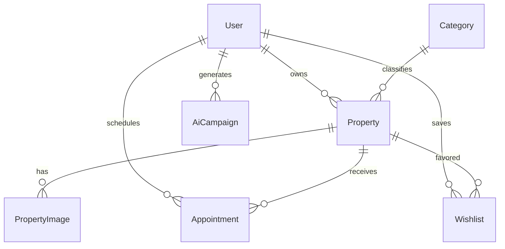

# BDS Rental - Hệ thống Tìm kiếm & Cho thuê Bất động sản (Next.js Version)

**BDS Rental** là một nền tảng tìm kiếm, đăng tin và quản lý bất động sản (cho thuê và mua bán) toàn diện được di chuyển từ Laravel sang **Next.js (App Router, TypeScript)**. Hệ thống hướng tới trải nghiệm người dùng cao cấp với giao diện hiện đại, khả năng định vị GPS, tìm kiếm bản đồ thời gian thực, tích hợp Sales Chatbot AI và bộ công cụ AI Marketing/Content Studio mạnh mẽ.

---

## 🚀 Tính năng nổi bật (Core Features)

### 1. Phân quyền Người dùng (User Roles)
Hệ thống sử dụng **NextAuth.js** để quản lý phiên đăng nhập và hỗ trợ 3 nhóm đối tượng người dùng:
* **Khách thuê / Khách mua (Tenant)**:
  * Tìm kiếm tin đăng theo vị trí, khoảng giá, diện tích, tiện ích và hướng nhà.
  * Tìm kiếm nâng cao trực quan trên Bản đồ tương tác.
  * Gợi ý tự động (Autocomplete) khi gõ từ khóa (tỉnh thành, quận huyện, phường xã, tên dự án).
  * Đặt lịch hẹn xem nhà trực tiếp (nhập Họ tên, SĐT, Email, Ngày & Giờ, Ghi chú). Tự động đồng bộ và lưu trữ Lead 2 bước lên hệ thống CRM.
  * Lưu trữ danh sách tin đăng yêu thích (Wishlist).
  * **Đăng ký làm chủ nhà**: Nhập thông tin để nâng cấp tài khoản từ Khách thuê thành Đối tác Chủ nhà ngay lập tức.
* **Chủ nhà / Môi giới (Owner)**:
  * Đăng tin bán/cho thuê bất động sản (tự động phê duyệt và hiển thị ngay lập tức).
  * Quản lý danh sách tin đăng (CRUD, ẩn/hiển thị tin đăng).
  * Tiếp nhận và duyệt/từ chối lịch hẹn xem nhà từ khách thuê.
  * Sử dụng bộ công cụ **AI Marketing & Content Studio** để tự động hóa quảng bá dự án.
* **Quản trị viên (Admin)**:
  * Thống kê tổng quan hoạt động hệ thống qua các biểu đồ trực quan (số lượng thành viên, tin đăng mới, lịch hẹn, thống kê).
  * Quản lý & kiểm duyệt tin đăng.
  * Quản trị thành viên (Mở/Khóa tài khoản).
  * Quản trị danh mục loại hình bất động sản.

### 2. Bản đồ Tìm kiếm Tương tác (Map Search)
* Bản đồ tràn viền sử dụng **MapLibre GL JS** hiển thị trực quan các ghim giá bất động sản theo tọa độ thực tế.
* Sidebar danh sách tin đăng đồng bộ vị trí, tự động highlight ghim tương ứng khi hover qua thẻ tin.
* Tích hợp nút **Định vị GPS**: Tự động xác định vị trí hiện tại của người dùng qua Geolocation API của trình duyệt và zoom bản đồ đến khu vực xung quanh.
* Bộ lọc ngang capsule gọn gàng, hiển thị nhanh các tiêu chí: Loại giao dịch (Bán/Thuê), Loại hình, Giá, Diện tích, Hướng nhà.

### 3. Tìm kiếm & Autocomplete Thông minh
* Ô nhập liệu hỗ trợ tự động gợi ý (Autocomplete) lấy dữ liệu địa giới hành chính (Tỉnh/Thành, Quận/Huyện, Phường/Xã) toàn quốc từ **API NKS** kết hợp dữ liệu bất động sản trong Database.
* Tối ưu hóa truy vấn PostgreSQL bằng chỉ mục Prisma Client kết hợp tìm kiếm vị trí tối ưu.

### 4. Xác thực tài khoản & Quản lý thông tin cá nhân (Profile & Verification)
* **Cập nhật Ảnh đại diện nâng cao**: Cho phép tải ảnh, thu phóng, xoay và cắt ảnh tròn (Cropper.js) trực quan. Ảnh đã cắt được chuyển đổi sang Base64 và đồng bộ trực tiếp lên API NKS. Hỗ trợ cơ chế tự phục hồi lỗi (failover) an toàn bằng cách kéo và đồng bộ link ảnh trực tuyến từ NKS CDN.
* **Xác thực CCCD bằng AI OCR**: Tích hợp **FPT AI OCR API** giúp quét và tự động bóc tách thông tin từ ảnh 2 mặt CCCD gửi lên dạng Base64 để điền nhanh vào form (Số CCCD, Họ tên, Ngày sinh, Ngày cấp, Nơi cấp).
* **Trạng thái Xác Thực**:
  - Tài khoản tự động hiển thị biểu tượng tích xanh và nhãn **"Đã xác thực"** tại Sidebar và Header ngay khi thông tin CCCD được cập nhật.
  - Khóa form và hiển thị giao diện xem thông tin CCCD an toàn (Read-only view).

### 5. Sales Chatbot AI (AI Assistant)
* AI Agent tư vấn dự án, giới thiệu sản phẩm, so sánh dự án, tính khoản vay và hướng dẫn khách hàng đặt lịch xem nhà trực tiếp.
* Quy tắc tư vấn nghiêm ngặt: Chỉ dựa vào dữ liệu CRM thực tế, nói không với thông tin bịa đặt, và luôn kết thúc bằng lời mời đặt lịch xem nhà.
* Đồng bộ hóa Lead từ Chatbot trực tiếp về DB và hệ thống CRM Wordpress (ACF Fields) qua 2 bước (Tạo Lead sau đó update thông tin root level).

### 6. AI Marketing & Content Studio (Mới)
Tích hợp trí tuệ nhân tạo **Gemini API** giúp chủ nhà tự động hóa khâu tiếp thị:
* **Chiến dịch Marketing đa kênh**: 
  - Tạo nhanh 20 bài đăng Facebook đa góc nhìn.
  - Tạo 10 kịch bản video ngắn TikTok/Shorts (kèm Prompt tiếng Anh chi tiết để đưa vào các công cụ sinh video AI và gợi ý công cụ AI khuyên dùng như Runway Gen-3, Luma Dream Machine, Kling AI).
  - Biên soạn 5 bài viết chuẩn SEO Website dạng HTML.
  - Tạo mẫu Email marketing, SMS/Zalo ZNS và Prompt vẽ ảnh Midjourney.
* **AI Content Studio (Tự do)**: Soạn thảo nội dung tự do theo yêu cầu bất động sản, sinh ảnh minh họa Thumbnail và tích hợp giọng đọc nhân tạo **Voiceover Text-to-Speech** trực quan ngay trên trình duyệt web.
* **Nút chia sẻ mạng xã hội**: Hỗ trợ copy nhanh và chuyển tiếp trực tiếp sang đăng bài trên Facebook, Zalo, hoặc gửi Email chỉ với 1 click.
* **Lịch sử Chiến dịch**: Lưu trữ, xem lại và quản lý các nội dung AI đã sinh.

---

## 🛠️ Công nghệ sử dụng (Tech Stack)

* **Framework**: Next.js 15 (App Router, TypeScript).
* **Database & ORM**: PostgreSQL, Prisma Client.
* **Authentication**: NextAuth.js v5.
* **AI APIs**:
  - Google Gemini API (`@google/generative-ai`) cho AI Marketing.
  - FPT AI OCR API cho quét chứng minh thư CCCD.
* **Frontend UI**:
  - Tailwind CSS v4, Vanilla CSS.
  - Lucide React & FontAwesome.
  - MapLibre GL JS & React Map GL cho bản đồ tương tác.
  - Recharts cho biểu đồ thống kê.
* **Hosting**: Vercel & GitHub.

---

## 📊 Sơ đồ Cơ sở Dữ liệu (Prisma Schema)

### Các Models chính trong Prisma:
1. **User**: Lưu thông tin tài khoản, vai trò (`admin`, `owner`, `user/tenant`) và các trường CCCD đã được bóc tách từ AI OCR.
2. **Category**: Lưu danh mục loại hình nhà đất (Căn hộ, Nhà riêng, Phòng trọ, Mặt bằng, Văn phòng, Đất nền).
3. **Property**: Lưu chi tiết thông tin bất động sản, giá tiền, toạ độ địa lý (`latitude`, `longitude`).
4. **PropertyImage**: Danh sách ảnh của dự án.
5. **Appointment**: Quản lý lịch hẹn xem nhà giữa Khách thuê và Chủ nhà.
6. **AiCampaign**: Lưu lịch sử các chiến dịch marketing được sinh ra bởi Gemini AI.
7. **Wishlist**: Bảng lưu danh sách yêu thích của người dùng.
