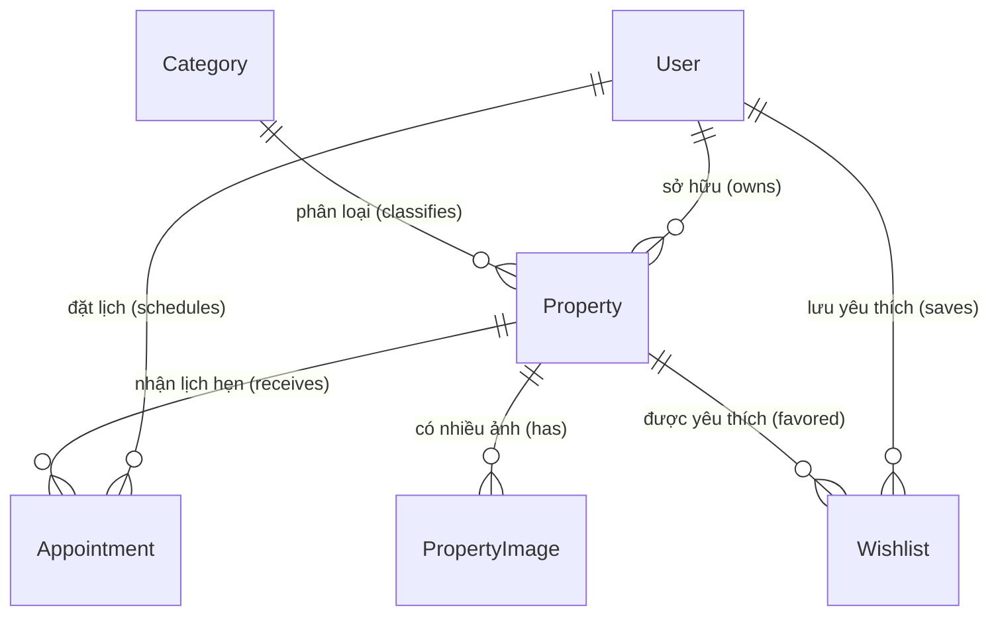

# BDS Rental - Hệ thống Tìm kiếm & Cho thuê Bất động sản

**BDS Rental** là một nền tảng tìm kiếm, đăng tin và quản lý bất động sản (cho thuê và mua bán) toàn diện được xây dựng trên nền tảng framework Laravel. Hệ thống hướng tới trải nghiệm người dùng cao cấp với giao diện hiện đại, khả năng định vị GPS, tìm kiếm bản đồ thời gian thực và gợi ý tự động thông minh.

---

## 🚀 Tính năng nổi bật (Core Features)

### 1. Phân quyền Người dùng (User Roles)
Hệ thống hỗ trợ 3 nhóm đối tượng người dùng chuyên biệt với trang Dashboard cá nhân hóa:
* **Khách thuê / Khách mua (Tenant)**:
  * Tìm kiếm tin đăng theo vị trí, khoảng giá, diện tích, tiện ích và hướng nhà.
  * Tìm kiếm nâng cao trực quan trên Bản đồ tương tác.
  * Gợi ý tự động (Autocomplete) khi gõ từ khóa (tỉnh thành, quận huyện, phường xã, tên dự án).
  * Đặt lịch hẹn xem nhà trực tiếp với chủ nhà/môi giới.
  * Lưu trữ danh sách tin đăng yêu thích (Wishlist).
* **Chủ nhà / Môi giới (Owner)**:
  * Đăng tin bán/cho thuê bất động sản (chờ kiểm duyệt từ Admin).
  * Quản lý danh sách tin đăng (CRUD, ẩn/hiển thị tin đăng).
  * Tiếp nhận và duyệt/từ chối lịch hẹn xem nhà từ khách thuê (kèm lý do từ chối).
* **Quản trị viên (Admin)**:
  * Thống kê tổng quan hoạt động hệ thống qua biểu đồ trực quan (số lượng thành viên, tin đăng mới, lịch hẹn, doanh số).
  * Quản lý & kiểm duyệt tin đăng (Duyệt, từ chối, ẩn tin đăng).
  * Quản trị thành viên (Mở/Khóa tài khoản, xóa tài khoản vi phạm).
  * Quản trị danh mục loại hình bất động sản.

### 2. Bản đồ Tìm kiếm Tương tác (Map Search)
* Bản đồ tràn viền sử dụng **MapLibre GL JS** hiển thị trực quan các ghim giá bất động sản theo tọa độ thực tế.
* Sidebar danh sách tin đăng đồng bộ vị trí, tự động highlight ghim tương ứng khi hover qua thẻ tin.
* Tích hợp nút **Định vị GPS**: Tự động xác định vị trí hiện tại của người dùng qua Geolocation API của trình duyệt và zoom bản đồ đến khu vực xung quanh.
* Bộ lọc ngang capsule gọn gàng, hiển thị nhanh các tiêu chí: Loại giao dịch (Bán/Thuê), Loại hình, Giá, Diện tích, Hướng nhà, v.v.

### 3. Tìm kiếm & Autocomplete Thông minh
* Ô nhập liệu hỗ trợ tự động gợi ý (Autocomplete) lấy dữ liệu địa giới hành chính (Tỉnh/Thành, Quận/Huyện, Phường/Xã) toàn quốc từ **API NKS** kết hợp dữ liệu bất động sản trong Database.
* Tối ưu hóa truy vấn PostgreSQL bằng chỉ mục **GIN Trigram Indexes** (`pg_trgm`) trên các trường tìm kiếm chính (`title`, `city`, `district`, `ward`) giúp cải thiện tốc độ tìm kiếm chuỗi con tự do (`ILIKE`) gấp nhiều lần so với chỉ mục thông thường.

### 4. Xác thực tài khoản & Quản lý thông tin cá nhân (Profile & Verification)
* **Cập nhật Ảnh đại diện nâng cao**: Cho phép tải ảnh, thu phóng, xoay và cắt ảnh tròn (Cropper.js) trực quan. Ảnh đã cắt được chuyển đổi sang Base64 và đồng bộ trực tiếp lên API NKS. Hỗ trợ cơ chế tự phục hồi lỗi (failover) an toàn trên môi trường Serverless chạy Read-only File System bằng cách kéo và đồng bộ link ảnh trực tuyến từ NKS CDN.
* **Xác thực CCCD bằng AI OCR**: Tích hợp **FPT AI OCR API** giúp quét và tự động bóc tách thông tin từ ảnh 2 mặt CCCD gửi lên dạng Base64 để điền nhanh vào form (Số CCCD, Ngày sinh, Ngày cấp, Nơi cấp, Quê quán, Thường trú).
* **Trạng thái Xác Thực & Toggled View**:
  - Tài khoản tự động hiển thị biểu tượng tích xanh và nhãn **"Đã xác thực"** tại Sidebar và Header ngay khi thông tin CCCD được cập nhật (`id_number` không trống).
  - Khóa form và hiển thị giao diện xem thông tin CCCD an toàn (Read-only view).
  - Tích hợp nút **"Chỉnh sửa thông tin"** để chuyển sang chế độ sửa đổi và nút **"Hủy bỏ"** để quay về chế độ xem.
  - Tự động phân giải và sửa lỗi vỡ hình ảnh CCCD từ NKS API (đường dẫn tương đối `users/`) bằng cách trỏ về link CDN lưu trữ chuẩn của NKS `https://data.nks.vn/storage/...`.

---

## 🛠️ Công nghệ sử dụng (Tech Stack)

* **Backend**: PHP 8.x, Laravel Framework.
* **Database**: PostgreSQL (hỗ trợ extensions `pg_trgm` tối ưu tìm kiếm).
* **Frontend**:
  * **HTML5 / Vanilla CSS / Tailwind CSS**: Thiết kế hiện đại, bo góc tròn sâu (`rounded-3xl`), vách chia thanh lịch và hiệu ứng glassmorphism.
  * **Alpine.js**: Điều khiển các tương tác động (Autocomplete, đóng/mở dropdowns, collapsible drawer bộ lọc nâng cao, carousel ảnh, và định vị GPS).
  * **MapLibre GL JS**: Bản đồ tương tác hiệu năng cao.
  * **Chart.js**: Vẽ biểu đồ thống kê tại Admin Dashboard.
* **Deployment & Hosting**: GitHub, Vercel.

---

## 📊 Sơ đồ Cơ sở Dữ liệu (Database Schema)

Hệ thống quản lý dữ liệu thông qua 6 bảng chính có quan hệ chặt chẽ:



### Các Models chính:
1. **User**: Lưu thông tin tài khoản, avatar, vai trò (`admin`, `owner`, `tenant`) và trạng thái (`active`, `locked`).
2. **Category**: Lưu danh mục loại hình nhà đất (Căn hộ, Nhà riêng, Phòng trọ, Mặt bằng, Văn phòng, Kho xưởng, Đất nền).
3. **Property**: Lưu chi tiết thông tin bất động sản bao gồm mục đích (`sale`/`rent`), trạng thái duyệt (`pending`, `approved`, `hidden`, `rejected`), thông số kỹ thuật (giá, diện tích, số phòng, hướng, nội thất) và tọa độ địa lý (`latitude`, `longitude`).
4. **PropertyImage**: Lưu trữ danh sách ảnh dự án, liên kết khóa ngoại với `Property` và đánh dấu ảnh chính (`is_primary`).
5. **Appointment**: Quản lý lịch hẹn xem nhà giữa Khách thuê và Chủ nhà.
6. **Wishlist**: Bảng lưu trữ liên kết tin đăng yêu thích của người dùng.

---

## 📁 Cấu trúc Thư mục chính (Directory Structure)

```bash
├── app/
│   ├── Http/
│   │   ├── Controllers/
│   │   │   ├── Admin/             # Điều hướng dành cho Quản trị viên
│   │   │   ├── Owner/             # CRUD tin đăng và duyệt lịch hẹn của Chủ nhà
│   │   │   └── Public/            # Các trang public, đặt lịch hẹn, yêu thích, Auth
│   │   └── Requests/              # Request Validation an toàn (Ví dụ: SearchPropertyRequest)
│   ├── Models/                    # Định nghĩa các thực thể dữ liệu (User, Property, v.v.)
│   └── Services/                  # Lớp xử lý nghiệp vụ (Ví dụ: PropertyService xử lý tìm kiếm song song DB + API)
├── database/
│   ├── migrations/                # Schema cơ sở dữ liệu và GIN indexes
│   └── seeders/                   # Dữ liệu mẫu (Users, Properties, Categories)
├── public/
│   └── build/                     # Các file assets (CSS, JS) đã build từ Vite
├── resources/
│   ├── css/
│   ├── js/
│   └── views/                     # Blade Templates giao diện chính
│       ├── components/            # Các thành phần tái sử dụng (navbar, footer, hero, card)
│       ├── layouts/               # Layouts khung của trang web
│       ├── listings.blade.php     # Trang danh sách bất động sản dạng lưới
│       └── map.blade.php          # Trang bản đồ tương tác toàn màn hình
├── routes/
│   └── web.php                    # Định nghĩa toàn bộ hệ thống định tuyến (Routes)
└── package.json                   # Cấu hình scripts build Vite & dependencies
```

---

## ⚙️ Cấu hình & Cài đặt (Setup Instructions)

### 1. Yêu cầu hệ thống
* PHP >= 8.1
* Composer
* Node.js & NPM
* Cơ sở dữ liệu PostgreSQL (hoặc MySQL/SQLite nếu cấu hình lại driver)

### 2. Các bước cài đặt
1. Clone dự án về máy:
   ```bash
   git clone https://github.com/leduchai1784/BDS.git
   cd BDS
   ```
2. Cài đặt các gói thư viện Backend:
   ```bash
   composer install
   ```
3. Cài đặt các gói thư viện Frontend:
   ```bash
   npm install
   ```
4. Sao chép và cấu hình file môi trường `.env`:
   ```bash
   cp .env.example .env
   ```
   *Cấu hình lại các thông số kết nối Database (`DB_CONNECTION`, `DB_HOST`, `DB_PORT`, `DB_DATABASE`, `DB_USERNAME`, `DB_PASSWORD`) trong file `.env`.*

5. Tạo khóa ứng dụng (App Key):
   ```bash
   php artisan key:generate
   ```

6. Chạy migrations và seed dữ liệu mẫu:
   ```bash
   php artisan migrate --seed
   ```

7. Biên dịch assets cho môi trường phát triển hoặc production:
   * Môi trường phát triển (Hot Reloading):
     ```bash
     npm run dev
     ```
   * Build bản Production:
     ```bash
     npm run build
     ```

8. Khởi chạy máy chủ phát triển:
   ```bash
   php artisan serve
   ```
   Ứng dụng sẽ khả dụng tại địa chỉ: `http://127.0.0.1:8000`

---

## 🔄 Quy trình Đồng bộ Git & Vercel (Git & Vercel Sync Workflow)

Hệ thống được cấu hình tự động triển khai (Auto Deployment) thông qua liên kết giữa GitHub và Vercel. Khi bạn hoàn thành code và thực hiện đẩy lên GitHub, Vercel sẽ tự động build và cập nhật phiên bản mới nhất.

Các bước thực hiện cập nhật code:

1. **Biên dịch assets (Nếu có thay đổi giao diện, CSS hoặc JS)**:
   ```bash
   npm run build
   ```
2. **Kiểm tra trạng thái các file thay đổi**:
   ```bash
   git status
   ```
3. **Thêm toàn bộ thay đổi vào hàng đợi (Stage changes)**:
   ```bash
   git add .
   ```
4. **Tạo commit với thông điệp mô tả thay đổi**:
   ```bash
   git commit -m "feat/style/fix: mô tả ngắn gọn thay đổi của bạn"
   ```
5. **Đẩy code lên repository GitHub**:
   ```bash
   git push origin main
   ```
   *(Sau khi lệnh push hoàn tất, Vercel sẽ tự động nhận diện commit mới trên nhánh `main` và tiến hành deploy lại trang web trong vòng 1-2 phút).*

